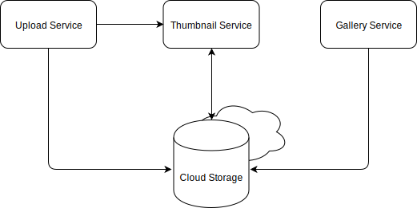

# Thumby - Container Deployment in der Cloud

Thumby - der Thumbnailing Service - ist eine, aus kleinen Services, zusammengesetzte Software zum hochladen von Bildern,
generierung von Thumbnails und einer Gallerie zur Anzeige der Ergebnisse.



## TOC

[Schritt 1: Konfiguration des lokalen Google Cloud SDK und der gcloud CLI](#schritt-1-konfiguration-des-lokalen-google-cloud-sdk-und-der-gcloud-cli)

[Schritt 2: (Optional) Erstellen eines Projektes](#schritt-2-erstellen-eines-projektes-optional)

[Schritt 3: Erstellen des Clusters](#schritt-3-erstellen-des-clusters)

[Schritt 4: Container Registry](#schritt-4-container-registry)

[Schritt 5: Cloud Storage](#schritt-5-cloud-storage)

[Schritt 6: Kubernetes Deployment](#schritt-6-kubernetes-deployment)

[Schritt 7: Aufräumen](#schritt-7-aufr%C3%A4umen)

## Einleitung

Die einzelnen Thumby Services sind bereits in Container verpackt und sollen in der Cloud auf einem Kubernetes Deployt werden.

<details><summary>:mag_right: CLICK ME</summary><p>

---
Die Vorteile von Kubernetes (K8s) als Werkzeug für automatisches Deployment, transparente horizontale Skalierung und Management
der Container Infrastruktur sind weitläufig bekannt und sollen auch nicht Teil des Artikels sein. Vielmehr scheint
K8s mittlerweile zum Industriestandard geworden zu sein und mehr und mehr Software Projekte werden dahingehend modernisiert um
sinnvoll in Container verpackt und in einer Kubernetes Landschaft deployt werden zu können.

Natürlich ist es möglich einen Kubernetes On-Premise, im eigenen Rechenzentrum, zu installieren, allerdings bieten
mittlerweile alle großen (und kleinen) Cloud Anbieter Kubernetes Instanzen im Mietmodell an. Der große Vorteil dieser
gemanagten Instanzen liegt auf der Hand, um Bereitstellung, Updates, Verfügbarkeit kümmert sich jemand anderes und die
Inhouse Entwicklung kann sich somit komplett auf die Entwicklung der Wertschöpfenden Business Funktionalität konzentrieren.

> Ob Inhouse Kubernetes oder gemieteter Service aus der Cloud, am Ende ist es eine klassische Make-Or-Buy Entscheidung.

Ein Anbieter von verwalteten Kubernetes Clustern ist z.B. Google mit seiner Google Kubernetes Engine (GKE). Zwar sind
die Funktionen und Bedienkonzepte der Verschiedenen Anbieter oft ähnlich, haben aber ihre Nuancen. Dieser Artikel greift die
Feinheiten der GKE auf und erklärt Schritt für Schritt wie die Plattform für das eigene Projekt
genutzt werden kann.

---
</p></details>

## Schritt 1: Konfiguration des lokalen Google Cloud SDK und der gcloud CLI

<details><summary>:mag_right: CLICK ME</summary><p>

---
Das Google Command Line Tool ist neben dem Web Interface (Cloud Konsole) und der Rest API ein mächtiges Werkzeug um mit
der Platform zu interagieren. Die CLI kann besonders bei später Automatisierung hilfreich sein.

Zur Nutzung der Google Cloud Plattform aus der Kommandozeile, muss zuvor die gcloud CLI installiert werden.
Alternativ kann die Cloud Shell im Browser genutzt werden: [Cloud Shell](https://console.cloud.google.com/cloudshell)

Google unterscheidet zwischen 'regions' und 'zones'. Jede Region ist der Standort eines Google Rechenzentrums und beinhaltet
eine Menge an, voneinander isolierten, Zonen. Je nach Standort kann eine andere Region sinnvoll sein, hier wird als
Standard Region Frankfurt (europe-west3) und innerhalb dieser Region die Zone 'b' (europe-west3-b) ausgewählt.

---
</p></details>

Nach herunterladen und entpacken des [Google Cloud SDK](https://cloud.google.com/sdk/docs/quickstarts) wird die CLI wie folgt konfiguriert:

`gcloud init` 

Startet den Konfigurationsprozess. Unter anderem wird hier die gewünschte 'Region' und 'Zone' ausgewählt, die die CLI als
default nutzen soll. Natürlich kann dies später für jeden genutzten Service angepasst werden.

```
region = europe-west3 (Frankfurt)
zone = europe-west3-b
```

```bash
gcloud config set compute/region europe-west3
gcloud config set compute/zone europe-west3-b
```

War die Installation erfolgreich, zeigt `gcloud info` die Konfigurationsparameter und weitere Infos an.

<details><summary>:mag_right: CLICK ME</summary><p>

---
TIP: Eine Übersicht über alle Regionen und Zonen ist unter https://cloud.google.com/compute/docs/regions-zones zu finden.

Die Nutzung des `gcloud` commands folgt immer dem gleichen Muster:
```
gcloud [optional flags] <group | command> [optional flags] <sub-group | command> <command> [optional flags]

```

Sollen zum Beispiel alle aktuell vorhanden Projekte aufgelistet werden, kann die Liste mit `gcloud projects list` abgerufen werden.

|gcloud |group |command
|------|-----|-----
|gcloud|projects|list

---
</p></details>

### Google Cloud SDK Komponenten
<details><summary>:mag_right: CLICK ME</summary><p>

---
Das Google Cloud SDK besteht aus Komponenten, die bei Bedarf installiert werden können. Um alle verfügbaren
(installierten und nicht installierten) Komponenten anzuzeigen, steht der Befehl `gcloud components list` zur Verfügung.

---
</p></details>

`gcloud components update` aktualisiert alle bereits installierten Komponenten.

Für die Nutzung des Kubernetes Services müssen folgende Komponenten installiert werden:

```bash
gcloud components install kubectl   #1
```
1. *kubectl*: Kubernetes commandline tool zum Steuern des Kubernetes Clusters.

## Schritt 2: Erstellen eines Projektes (Optional)
<details><summary>:mag_right: CLICK ME</summary><p>

---
Resourcen, Einstellungen, Berechtigungen, Billing etc. sind innerhalb der GCP in Projekte gekapselt.
Ein Projekt ist also eine übergeordnete Organisationseinheit und kann ebenfalls per CLI erstellt werden:

---
</p></details>

```bash
gcloud projects create thumby-workshop-<num> \  #1
    --name="K8s Demo Project" \                 #2
    --organization=111111111111 \               #3
    --set-as-default \                          #4
```
1. Das gcloud Command zum Anlegen eines Projektes mit der ID '*thumby-workshop-<num>*' (die ID muss eindeutig sein).
2. Der Name des Projektes.
3. Die Organisations-ID in der das Projekt angelegt werden soll (siehe folgenden Abschnitt).
4. Definiert das erstellte Projekt als Standard Projekt für die lokale gcloud Installation.

`gcloud projects list` sollte jetzt das neu erstellte Projekt enthalten.

### Organisationen

`gcloud organizations list`

<details><summary>:mag_right: CLICK ME</summary><p>

---
Eine Organisation ist die Root Node für alle Projekte. Eine Organisation wird inital automatisch angelegt.
Um alle Organisationen aufzulisten kann `gcloud organizations list` genutzt werden. Das Ergebnis ist eine Liste aller
vorhanden Organisationen inklusive Ihrer IDs. Typischerweise existiert zu Beginn eine Organisation der verschiedene Projekte zugewiesen werden.

---
</p></details>

### Verlinken mit Billing Account
<details><summary>:mag_right: CLICK ME</summary><p>

---
Um die korrekte Abrechnung zu gewährleisten muss das neu erstellte Projekt noch mit einem 'Billing Account' verbunden werden.
Diese Funktion steht aktuell nur in den _beta_ Komponenten zur Verfügung und kann sonst nur über das Web Interface erreicht werden.

---
</p></details>

```bash
gcloud components install beta                              #1
gcloud beta billing projects link thumby-workshop-<num> \   #2
    --billing-account=0X0X0X-0X0X0X-0X0X0X                  #3
```
1. Google stellt über die _beta_ und _alpha_ Komponenten neue Funktionalität zur Verfügung, die sich noch im jeweiligen Entwicklungsstadium befindet.
2. Erzeugt einen Billing Link zu dem neu erstellten Projekt. Die eingesetzte ID ist die ID des zuvor erstellten Projektes.
3. Der Billing Account, der verlinkt werden soll. `gcloud beta billing accounts list` gibt eine Liste aller, zur Verfügung stehenden Accounts.

## Schritt 3: Erstellen des Clusters
<details><summary>:mag_right: CLICK ME</summary><p>

---
Die einzelnen https://cloud.google.com/terms/services[Services] der GCP wie die Container oder Compute Engine
müssen pro Projekt aktiviert werden um sie nutzen zu können.
Zum Anlegen des Kubernetes Clusters werden folgende Dienste benötigt.

---
</p></details>

```bash
gcloud services enable container.googleapis.com #1
gcloud services enable compute.googleapis.com   #2
```
1. Der container service ist zuständig für das Kubernetes und die Container Registry
2. Der compute service stellt die zugrunde liegenden VMs bereit

### Der Cluster
<details><summary>:mag_right: CLICK ME</summary><p>

---
Bis hierher war alles initiales Setup und muss pro Projekt nur einmal durchgeführt werden. Jetzt kann, endlich, der
Cluster maßgeschneidert und gestartet werden. Mit dem folgenden Command startet Google in der, zuvor ausgewählten Zone (europe-west3-b),
die Kubernetes Instanz und initialisiert die Knoten.

Es dauert einige Minuten, bis der Cluster zur Verfügung steht. Die hier aufgelistet Parameter sind (natürlich) nicht
alle verfügbaren Optionen. Eine ausführliche Liste mit der Beschreibung aller Parameter ist https://cloud.google.com/sdk/gcloud/reference/beta/container/clusters/create[hier] zu finden.

TIP: Beim Anlegen des Clusters kann es sein, dass Warnungen angezeigt werden. Hierbei handelt es sich meistens um Änderungen in der
Konfiguration, die Google in Zukunft hinzufügen/entfernen möchte (besonders bei der Nutzung der _beta_ Funktionalität). Fürs erste können
die Meldungen ignoriert werden, sind aber zu einem späteren Zeitpunkt sicherlich interessant.

---
</p></details>

```bash
gcloud container clusters create "my-first-cluster" \       #1
    --project thumby-workshop-<num> \                       #2
    --cluster-version "1.10.7-gke.6" \                      #3
    --machine-type "n1-standard-2" \                        #4
    --num-nodes "2" \                                       #5
    --enable-autorepair \                                   #6
    --enable-cloud-logging \                                #7
    --enable-cloud-monitoring \                             #8
    --scopes "compute-rw,storage-rw,default" \              #9
    --zone europe-west3-b                                   #10
```

```
gcloud container clusters create "my-first-cluster" --project thumby-workshop-<num> --cluster-version "1.10.7-gke.6" --machine-type "n1-standard-2" --num-nodes "2" --enable-autorepair --enable-cloud-logging --enable-cloud-monitoring --scopes "compute-rw,storage-rw,default" --zone europe-west3-b 
```

1. Basis Kommando zum erstellen eines neuen Clusters mit der ID: *my-first-cluster*.
2. Projekt in dem der Cluster angelegt wird (optional, da das frisch angelegt Projekt als default markiert wurde).
3. Die Cluster Version, hier gibt es regelmäßige Updates (zum Zeitpunkt des Artikels ist `1.10.7-gke.6` die aktuellste Cluster Version). Alle zur Verfügung stehenden Version lassen sich mit `gcloud container get-server-config` anzeigen.
4. Der Maschinentyp beschreibt die Konfiguration der zugrundliegenden VM. Die _n1-standard-2_ ist mit 2 vCPUs und 7.5GB Ram ausgestattet. Die ausgewählte Maschine steht natürlich in Relation zum Preis. Alle verfügbaren Maschinen lassen sich mit `gcloud compute machine-types list` auflisten.
5. Die Anzahl der Knoten im Cluster.
6. Autorepair, sollte Kubernetes feststellen, dass ein Knoten nicht mehr innerhalb der erwarteten Parameter funktioniert, initiiert das System automatisch einen Reparaturprozess für den defekten Knoten.
7. Cloud Logging, sammelt, verarbeitet und analysiert Container- und Systemprotokolle, diese können dann in der [Cloud Konsole](https://console.cloud.google.com/logs/viewer) eingesehen werden.
8. Cloud Monitoring, sammelt, verarbeitet und analysiert Container- und System Metriken, diese können dann in der [Cloud Konsole](https://console.cloud.google.com/logs/viewer) eingesehen werden
9. Definiert die Berechtigungen, die der Cluster bekommt um auf andere Ressourcen innerhalb des Projektes zuzugreifen.
10. Fordert an, dass der cluster in Frankfurt gehostet werden soll. Nicht notwendig wenn die `gcloud init` Schritte korrekt ausgeführt wurden, aber in der browserbasierten Konsole erforderlich.

### Status des Clusters
Ist der Cluster angelegt kann mit `gcloud container clusters list` eine Liste aller erstellten Cluster, im aktuellen Projekt, angezeigt werden.

<details><summary>:mag_right: CLICK ME</summary><p>

---
Da der K8s Cluster über die Kommandozeile anlegt wurde hat gcloud dafür gesorgt, dass das lokale `kubectl` den neuen Cluster kennt.

TIP: Sollte der Cluster im Browser erstellt worden sein, muss dieser dem `kubectl` noch bekannt gemacht werden.

```bash
gcloud container clusters get−credentials my-first-cluster
kubectl config set−cluster my-first-cluster
```

Jetzt kann `kubectl` genutzt werden um den Cluster weiter zu inspizieren. Der Status der einzelnen Komponenten lässt sich per
`kubectl get componentstatus` ermitteln. Während `kubectl get nodes` die vier Nodes auflisten sollte, die bei der Konfiguration
des Clusters definiert wurden. Detailierte Informationen zu einer Node lassen sich mit `kubectl describe nodes <node-id>` ermitteln.

---
</p></details>

## Kosten des Clusters
<details><summary>:mag_right: CLICK ME</summary><p>

---
Bei der Entscheidung ein Kubernetes in der Cloud zu mieten, ist der Blick auf die anfallenden Kosten ein wichtiger Aspekt.
Nach der Standardpreisliste werden für den oben konfigurierten Cluster, einen 24/7 Betrieb, Monatskosten von ca. 430,00 Euro berechnet.
Hierzu ist zu erwähnen, dass Google eine Reihe von Rabatten anbietet, die hier nicht mit eingerechnet sind, sich aber, besonders
im 24/7 Betrieb positiv auf den Preis auswirken.

> Kostenpolitik bei Cloud Anbietern ist sicherlich ein eigenes Thema (und einen eigenen Artikel wert), allerdings
kann mit ein bisschen Recherche und einem Überblick über die angebotenen Services am Ende oft ein Paket geschnürt werden,
dass kosteneffizenter ist, als es auf den ersten Blick aussieht.

- Instanz Typ: n1-standard-2
- Notes: 2
- Stunden pro Monat (24/7): 1460
- Region: Frankfurt
- GCE Instance Cost: **EUR 55,00**

---
</p></details>

## Schritt 4: Container Registry
<details><summary>:mag_right: CLICK ME</summary><p>

---
Anwendungen, wie Thumby, sind heute oft in Docker Images verpackt um sie möglichst effizient auf verschiedenen Plattformen bereitstellen zu können.
Ein Zentraler Speicher hilft die Images zu verwaltet und von jedem System drauf zuzugreifen. Eine wichtige Anforderung an eine
'Docker Container Registry' ist Sicherheit und Zuverlässigkeit. Die Container müssen gegen unbefugten Zugriff geschützt werden und sollen,
insbesondere während eines Deployment Prozesses, immer zur Verfügung stehen.

---
</p></details>

Aktivieren des Registry Services.
```bash
gcloud services enable containerregistry.googleapis.com
```

Um die Container Registry dem lokalen Docker Client bekannt zu machen, muss die gcloud Komponente _docker-credential-gcr_ installiert werden:

```bash
gcloud components install docker-credential-gcr
gcloud auth configure-docker 
```

Fügt den _credHelper_ Eintrag der Docker Konfiguration hinzu, damit ist gcloud als credential helper
registriert, das ermöglicht das pushen der Images in eine Google Docker Registry.

<details><summary>:mag_right: CLICK ME</summary><p>

---
Eine interessante Erweiterung für die Google Docker Registry ist der [image vulnerabilities check](https://cloud.google.com/container-registry/docs/get-image-vulnerabilities).
Einmal aktiviert, wird jedes Docker Images auf potentielle Sicherheitsprobleme untersucht.

Das Feature befindet sich derzeit im _alpha_ Stadium, kann aber bereits getestet werden.

```gcloud service enable containeranalysis.googleapis.com```

Zunächst muss der Container-Analyse-Dienst für das Projekt und
anschließend das vulnerability scanning auf der Settings Seite der Container Registry aktiviert werden.
[Enable vulnerability scanning](https://console.cloud.google.com/gcr/settings)

Details zur Analyse der Container kann [hier](https://cloud.google.com/container-registry/docs/container-analysis)™ gefunden werden.

---
</p></details>

### Pullen der Thumby-Images:
Die vorbereiteten Images für Thumby liegen bereits im global erreichbaren Docker Hub für euch bereit. Um sie in eure private Registry zu kopieren, müsst ihr sie zunächst herunterladen:

```bash
docker pull smartsquare/thumby-upload-service
docker pull smartsquare/thumby-gallery-service
docker pull smartsquare/thumby-generator-service
```


### Pushen des Images in die Google Registry

<details><summary>:mag_right: CLICK ME</summary><p>

---
Images die in die private Docker Registry gepushed werden sollen, müssen einer bestimmten Namenskonvention folgen.
Beginnend mit dem *gcr.io* Hostname der Registry. Dabei kann mit einem Standort Prefix gesteuert werden an welchem Server-Standort
das Images gespeichert werden soll, z.B. *eu.gcr.io*, *asia.gcr.io*. Ohne Prefix werden die Images (aktuell) in den USA gespeichert.

Der Hostname wird gefolgt von der Projekt-ID, dem Image Namen und optional einem Tag

TIP: *Für Java Applikationen*: [Jib](https://github.com/GoogleContainerTools/jib) stellt Maven/Gradle tasks zur Verfügung mit denen sich ganz bequem Docker Images bauen und pushen lassen, ganz ohne eigenes dockerfile.

---
</p></details>

Der entsprechende [Docker tag](https://docs.docker.com/engine/reference/commandline/tag) befehlt sieht dann wie folgt aus:
```bash
docker tag [SOURCE_IMAGE] [HOSTNAME]/[PROJECT-ID]/[IMAGE][:TAG]
```

```bash
docker tag smartsquare/thumby-upload-service gcr.io/thumby-workshop-<num>/upload-service:v1
docker tag smartsquare/thumby-gallery-service gcr.io/thumby-workshop-<num>/gallery-service:v1
docker tag smartsquare/thumby-generator-service gcr.io/thumby-workshop-<num>/generator-service:v1
```

`docker push` kopiert nun die Daten in die Registry.

```bash
docker push gcr.io/thumby-workshop-<num>/upload-service:v1
docker push gcr.io/thumby-workshop-<num>/gallery-service:v1
docker push gcr.io/thumby-workshop-<num>/generator-service:v1
```

`gcloud container images list` listet den Inhalt der Registry auf.

## Schritt 5: Cloud Storage

<details><summary>:mag_right: CLICK ME</summary><p>

---
Cloud Storage, als universeller Datenspeicher in der Cloud, lässt sich ebenfalls einfach und schnell per CLI konfigurieren.
Zuerst muss der Dienst für das aktuelle Projekt aktiviert werden.

Die Steuerung des Cloud Speichers übernimmt das `gsutil` Tool, welches sich über die gcloud Komponenten installieren lässt.

Ein Cloud Storage wird in 'Buckets' unterteilt. Ein Bucket kann für eine Region oder verteilt über mehrere Regionen
angelegt werden. Aus Nutzersicht gibt es keinen Unterschied, die GCP kümmert sich im Hintergrund um die Synchronisation der Daten in die verschieben Regionen.

---
</p></details>

```bash
gcloud services enable storage-component.googleapis.com
```

```bash
gcloud components install gsutil
```


```bash
# gsutil mb -p <projectId> -l <region> gs://my_new_fancy_bucket/

gsutil mb -p thumby-workshop-<num> \            #1
          -l europe-west3 \                     #2
          gs://thumby_bucket_<num>/                #3
```

```bash
gsutil mb -p thumby-workshop-<num> -l europe-west3 gs://thumby_bucket_<num>/
```

1. `gsutil` Anweisung um ein neues Bucket zu erstellen (mb = make bucket).
2. -l definiert die Region in der das Bucket erstellt werden soll, im konkreten Fall, wird ein Bucket in der Region Frankfurt (europe-west3) angelegt.
3. Definiert den Namen unter dem das Bucket angelegt werden soll.

<details><summary>:mag_right: CLICK ME</summary><p>

---

Falls ein multi regionales bucket benötigt wird, welches über alle Regionen ein Europa verteilt ist, muss zusätzlich
die 'Storage Class' gesetzt werden.

```bash
gsutil mb -p thumby-workshop-<num> \
          -l eu \                   #1
          -c multi_regional \       #2
          gs://k8s_bucket_2/
```
1. 'eu' steht für die komplette Region Europa, alternativ kann 'us' oder 'asia' gewählt werden.
2. Definiert die Storge-Klasse, verschiedene Klassen haben unterschiedliche Verfügbarkeits- und Kosten-Modelle. Mehr Informationen gibt es [hier](https://cloud.google.com/storage/docs/storage-classes).

---
</p></details>

## Kosten für Cloud Storage

<details><summary>:mag_right: CLICK ME</summary><p>

---
Die Kosten für die Registry sowie den Cloud Speicher errechnen sich nach gesamt genutztem Speicher,
ein- und ausgehendem Traffic, sowie der Region in der die Daten gespeichert sind.

Eine Beispielrechnung für einen Monat bei 15GB genutztem Speicher:

- Region: Frankfurt
- genutzter Speicher: 15 GB
- Schreib Zugriffe:10.000
- Lese Zugriffe: 50,000
- Kosten im Monat: **EUR 0.36**

TIP: Kosten lassen sich beim Verteilen von statischem Content sparen, indem anstatt auf multi regionalen Speicher auf das [Cloud CDN](https://cloud.google.com/cdn/) gesetzt wird. Das CDN kümmert sich, zu einem Bruchteil der Kosten, darum, dass der Content nahm am Kunden ausgeliefert wird.

---
</p></details>

## Schritt 6: Kubernetes Deployment

<details><summary>:mag_right: CLICK ME</summary><p>

---
Wie schon zuvor erwähnt besteht Thumby aus drei separaten Services, verpackt in Docker Container, welche jetzt in den erstellten Kubernetes Cluster deployt 
werden müssen. 
Kubernetes Deployments werden deklarativ in YAML files beschrieben und dann mit Hilfe des `kubectl` dem CLuster bekannt gemacht. 
Dabei wird Kubernetes der gewünschte Zustand einer Applikation vorgegeben, der Cluster unternimmt dann selbständig alle nötigen Schritte um die Anwendung
in den definierten Status zu bringen und trägt dafür Sorge, dass dieser Status bestehen bleibt. 

K8s arbeitet mit [Objekten](https://kubernetes.io/docs/concepts/overview/working-with-objects/kubernetes-objects/), 
diese persistenten Entitäten repräsentieren den Status des Clusters. Beschrieben werden diese Objekte in den, bereits angesprochenen, YAML Dateien.
Es gibt eine Vielzahl unterschiedlicher Objekte, die folgenden vier Objekte werden im Thumby Service verwendet:

Pods
Ein Pods repräsentiert eine Deploymenteinheit, er stellt eine Instance im Kubernetes da, welche aus einem (oder ggf. mehreren) Containern bestehen kann. 
Jeder Pod bekommt eine eigene IP, sowie eigenen Ressourcen zugewiesen. 

Services
Services sind logische Abstraktionen zu Pods. Da Pods bei jedem start eine neue IP bekommen, liefert der Service einen Eintrittspunkt für andere Teile
der Anwendung die mit einem bestimmten Pod kommunizieren wollen. Der Service kennt die replicas eines Pods und deren IP Adressen. Für den aufrufenden Service ist es 
demnach transparent wieviele Pods laufen und über welche IPs diese zu erreichen sind.

Deployments
Ein Deployment Objekt kombiniert die Definition eines Pods mit dessen ReplicaSet.

Ingress
Der Ingress managed den externen Zugriff auf die Service des Clusters. 

---
</p></details>

Zu jedem Thumby Service existiert eine Service sowie eine Deployment definition. Außerdem beinhaltet das Deployment einen Ingress, welcher den Upload- und Gallery-Service von außen erreichbar macht.

Exemplarisch wird hier auf das Deployment file des Upload Services eingegangen, das Deployment der Gallery und des Thumbnailers ist ähnlich.
Alle YAML files müssen, entsprechend der tags der hochgeladenen docker images, angepasst werden.

Upload Service K8s Definition
```yaml
apiVersion: v1
kind: Service               #1
metadata:
  name: upload-service      #2
spec:
  ports:                    #3
  - port: 8080
    protocol: TCP
    name: http
  sessionAffinity: ClientIP #4
  selector:                 #5
    app: upload-service
  type: NodePort            #6
```

1. Typ des Objektes
2. Name des services
3. Port und Protokoll auf dem der Pod erreichbar ist
4. Session Affinity, stellt sicher, dass ein User immer auf den gleichen Pod geleitet wird
5. Name des Pods die diesem Pod zugerodnet sind
6. Definiert wie der Service nach außen freigegeben wird. Fuur die genutzte Ingress Konfiguration wird hier ein statischer Port (Node Port) gennutzt. Mehr Informationen gibt es [hier](https://medium.com/google-cloud/kubernetes-nodeport-vs-loadbalancer-vs-ingress-when-should-i-use-what-922f010849e0)

Upload Deployment K8s Definition
```yaml
apiVersion: apps/v1
kind: Deployment            #1
metadata:
  name: upload-service      #2
spec:
  selector:
    matchLabels:
      app: upload-service
  replicas: 2               #3
  template:
    metadata:
      labels:
        app: upload-service
    spec:
      containers:           #4
      - name: upload-service
        image: gcr.io/thumby-workshop-<num>/upload-service:v1
        ports:
        - containerPort: 8080
        args:
        - --gcp.bucket-name=thumby_bucket_<num>
        - --thumbnail-service.port=8888
        - --thumbnail-service.hostname=generator-service.default
```

1. Typ des Objektes
2. Names des Deployments
3. Anzahl der zu startenden Instanzen
4. Definition des Containers

Ingress Definition
```yaml
apiVersion: extensions/v1beta1
kind: Ingress                           #1
metadata:
  name: thumby-ingress
  annotations:
    kubernetes.io/ingress.class: "gce"  #2
spec:
  backend:                        
    serviceName: upload-service         #3
    servicePort: 8080
  rules:
  - http:
      paths:
      - path: /                         #4
        backend:
          serviceName: upload-service
          servicePort: 8080
      - path: /gallery                  #5
        backend:
          serviceName: gallery-service
          servicePort: 9000
      - path: /gallery/*                #6
        backend:
          serviceName: gallery-service
          servicePort: 9000
```

1. Typ des Objektes
2. Implementierung des Ingress, fuur die GCE wird eine eigene Ingress Implementierung verwendet
3. Default Backend (upload-service)
4. Root-Path nutzt den upload backend-service
5. /gallery ruft den gallery service auf
6. extra * path auf gallery wird benötgit um die webresourcen richtig laden zu können

### kubectl

`kubectl` ist ein Command Line Tool um Operationen gegen den K8s Cluster auszuführen. Im folgende wird es verwendet um die YAML Dateien dem Cluster bekannt zu machen und Informationen zu den deployments abzurufen.

`kubectl apply -f <file>.yaml` wendet die definition aus der gegeben YAML Datei auf dem Cluster an, dabei kann es sich um neue Objekte, oder aber auch Updates habdeln.

`kubectl get pods` listet alle installierten Pods und deren Status auf.

`kubectl get ingress` zeigt alle vorhanden ingresses an.   

`kubectl logs -f <pod-id>` gibt die Logs des Pods auf STDOUT aus.

### Deployment

Mit Hilfe von kubectl werden die Objekte dem Cluster bekannt machen.

```bash
kubectl apply -f upload-service.yaml        #1
kubectl apply -f generator-service.yaml     #1
kubectl apply -f gallery-service.yaml       #1

kubectl apply -f ingress.yaml               #2

kubectl get pods                            #3
kubectl get ingress                         #4
```

1. Deployt die thumpy Services auf dem Cluster
2. Deployt die Ingress Definition
3. Listet die zuvor installierten Pods auf und zeigt den aktullen Status
4. Zeigt den zuvor installierten Ingress an, sobald der Ingress zur Verfügung steht, wird die öffentliche IP gelistet.

Upload Service: http://`<ip-address>`/

Gallery Service: http://`<ip-address>`/gallery

## Schritt 7: Aufräumen
Besonders beim Ausprobieren der Cloud Infrastruktur, sollte das Projekt wieder aufgeräumt werden, damit keine unnötigen Kosten entstehen.

```bash
gcloud container clusters delete <cluster-name> #1
gsutil ls                                       #2
gsutil rm -r gs://<bucket-name>                 #3
gsutil rm -r gs://<repository-name>             #4    
```

1. Löscht den Cluster
2. Listet alle vorhanden Buckets
3. Löscht das thumbnail bucket
4. Löscht die Registry images
